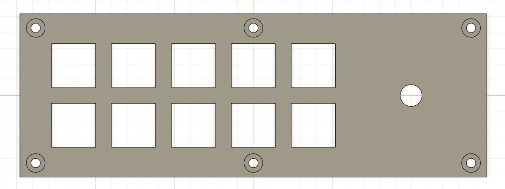

# Custom-Macro-Keyboard
Custom designed macro keyboard

Thingiverse: https://www.thingiverse.com/thing:5415824

This was personal project for my partner as he is a streamer and the extra keys to bind to use is very useful while being cheaper than a Elgato stream deck.
- The case was designed in Autodesk Fusion 360.
- Code written in Arduino IDE.

## Part choice
For this project, I knew I wanted a display for text, a volume control knob and at least 8 buttons. The buttons also had to have a nice feeling so i went with Cherry MX Brown switches as they are my partner's favourite kind of switch. I used re-legendable keycaps to allow for relabelling the keycaps at a later date if necessary. The components used in this project are:
- Arduino Pro Micro (I specifically looked for a USB-C version since it is most robust than USB-B Micro and reversible connector)
- Rotary Encoders with threads (KY-040) to mount to the base plate
- Cherry MX Brown switches (I bought a pack of 30 for future project use)
- 0.91" OLED i2C module (Black & White)
- USB-C Female Breakout board (To mount to the Base)
- USB-C Male connector (To prevent wear and tear to the USB-C port built on the arduino)
- Solid core wire (Various colours to aid in organisation)
- M3 Screws (To mount the key plate)
- M3 Threaded Inserts (To allow the screws to mount)
- Rubber feet (to stop the keyboard moving so much when keys are pressed)

## Tools
To finish this project, the following tools were used which I consider essential:
- Soldering Iron
- 3D Printer (Creality CR-10S-Pro Stock) with PLA filament
- Screwdriver
- Wire cutters (Or scissors)
- A device capable of flashing code to the arduino
- Super Glue (for holding the display in place without moving)
- Heatshrink tubing (Prevent shorts)

Nice to haves:
- Label maker (For keycaps)
- Hot air gun (To soften the PLA and activate the heat shrink)
- Sandpaper (To give a nicer finish)
- 

## Design
The design of the case was done in Fusion Autodesk 360 over 8 iterations. It has an angle of 45&deg; for the keyplate with the keyplate while the display is mounted at a slightly steeper 60&deg; angle. The key spacing between the keys is to the Cherry specification of 19mm centre to centre.

### Keyboard base

### Key plate

### Display plate

## Printing the parts
This took a ridiculous amount of time at 18 hours to print for the base alone. The display plate took 20 minutes and the Keyplate took about 2$\frac{1}{2}$ hours resulting in a total print time of 20 hours and 50 minutes not including prototype print. The base also printed with a lot of support which took a significant time to remove. In addition, I did not have good printer bed adhesion and as such used copious amount of glue to get the first layer to stick, however this glue resulted in lots of unevenness on the bottom which was luckily sorted out by the use of rubber feet on the corners.

## Soldering

### The arduino pins
I chose to solder pins rather than headers to the pcb so that i could easily hotswap it incase of failures since it is much easier to unplug 2 big headers than lots of small pins in order to take out the arduino. Another advantage is the size taken up by the pins which is significantly smaller height wise allowing to fit into the case without issue.

### Switch wiring
Initially all the switches were connected individually. However it was not a robust enough solution since the switch pins would fatigue from the constant movement and break easily. Therefore, I used solid core wire and twisted them together to make the entire assembly less prone to wear and be a lot stronger as a result. This also solved the issue of too many ground cables. The entire plate now just uses 1 ground connection which comes from the rotary encoder. Much better than 11 ground wires which I originally had. Each switch was connected to a pin on the pro micro which was pulled up and allowed for key press detection.

### Display wiring
Since I had not fully assembled the project when I was testing the display, I used a header block to allow me to easily plug and unplug the display.

### USB wiring
Since the arduino only supports USB 2.0 Speeds, there is no point in increasing complexity and cost to get a USB 3.0 Type C connector.
From Left to right on the image below:
- Black = Ground
- Green = Data-
- White = Data+
- Red = 5V

## Assembly

### Wiring
As a test fit, I tried putting everything in the base but the wires were too long so they needed to be shortened for the actual assembly.

### Key plate
The switches fit snugly into the mounts and the encoder is secured with a washer and nut which is hidden beneath the knob. Screw holes were added to mount the plate to the base.

### Mounting the arduino
Since i had soldered the pins to the arduino, this came with some concerns. Mainly the worry that the pins could come in contact with a metal surface and short out which is particulary dangerous since it could kill the arduino. To prevent this, I came up with a small base plate that the arduino will slot into and sit on while the project was being developed. In the actual case, it is attached with some command strips between the pcb and the floor of the base.

## End Result
The final result of assembly. The screws were swapped out to smaller headed M3 threaded ones to allow for a flush fit. Personally, I think it looks better this way. Behind each screw is a threaded insert that was pushed into the PLA using the soldering iron.

## Conclusion
Overall, this was a very fun project which was also very rewarding. However there are a number of things that I would change if I was to do this again, these being:
- The overall finish of the base should be smoother and the bottom should not be uneven to give a more appealing look.
- The weight of the base should be heavier to stop it moving around easily as the buttons and encoder are used.
- The angle of the buttons should be less agressive as it places quite a bit of stress on the wrist if used intensively for prolonged periods. 
- A bigger display which would allow for more details to be shown.
